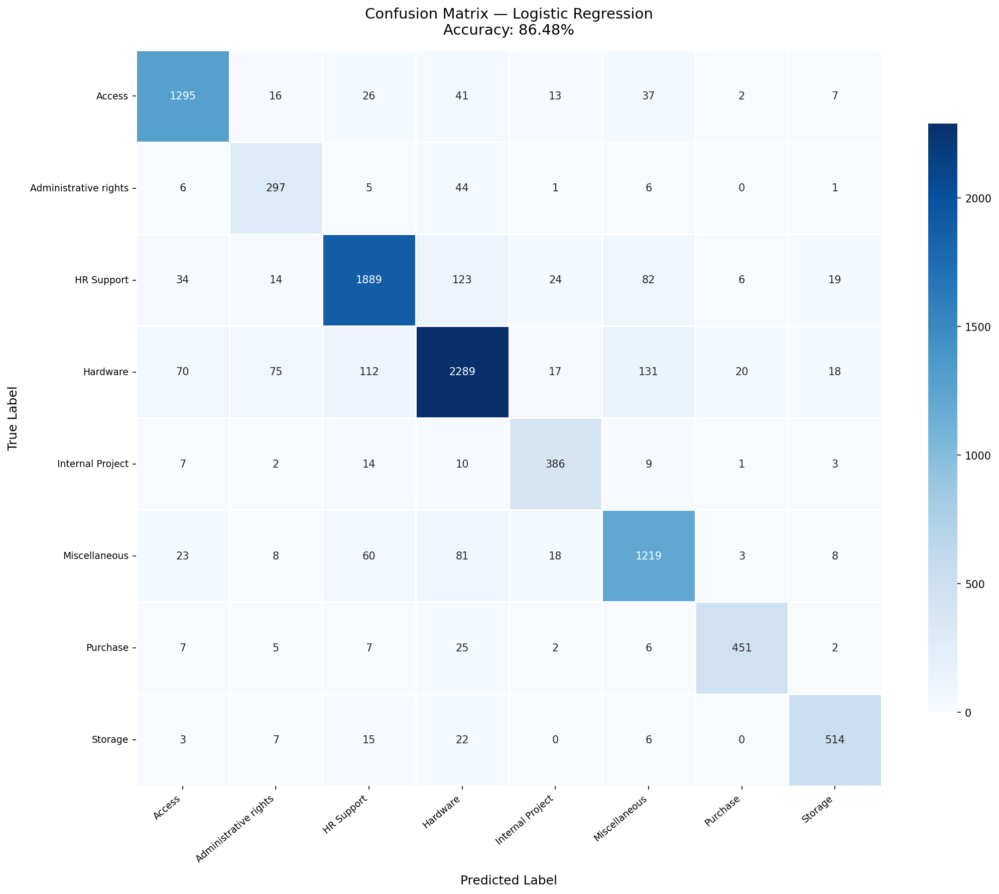

<div align="center">

# 🎫 TicketSense
### NLP-Powered IT Support Ticket Classifier

[](https://python.org)
[](https://fastapi.tiangolo.com)
[](https://react.dev)
[](https://scikit-learn.org)
[](https://support-ticket-catogeriser.vercel.app)
[](https://support-ticket-catogeriser.onrender.com)

**Automatically route, triage, and prioritise IT support tickets using Machine Learning.**  
Trained on 47,837 real service-desk tickets · 86.48% accuracy · 8 categories · REST API + React dashboard

[🚀 Live Demo](https://support-ticket-catogeriser.vercel.app) &nbsp;·&nbsp; [📖 API Docs](https://support-ticket-catogeriser.onrender.com/docs) &nbsp;·&nbsp; [🛠 Run Locally](#running-locally)

</div>

---

## ✨ Features

| Feature | Description |
|---|---|
| 🧠 **Smart Classification** | TF-IDF + Logistic Regression classifies tickets into 8 real IT categories instantly |
| ⚡ **Urgency Detection** | Weighted keyword rules flag tickets as **High / Medium / Low** urgency |
| 📊 **Confidence Scores** | Full probability breakdown across every category — not just a black-box label |
| 📂 **Batch CSV Processing** | Upload a spreadsheet, download every row classified in seconds |
| 🔄 **Informal Language Support** | `normalize_input()` expands abbreviations (pls → please, asap → urgent, etc.) so casual user text is handled correctly |
| 🌐 **REST API** | FastAPI with auto-generated Swagger docs at `/docs` |

---

## 🏷️ The 8 Categories

These are the **real IT service-desk categories** from the Kaggle dataset — not synthetic templates:

```
Access  ·  Hardware  ·  HR Support  ·  Storage
Purchase  ·  Administrative rights  ·  Internal Project  ·  Miscellaneous
```

---

## 🏗️ Architecture

```
┌─────────────────────────────────────────────────────────┐
│                     Vercel Hosting                       │
│                                                         │
│  ┌─────────────────────┐    ┌─────────────────────────┐ │
│  │   React SPA (Vite)  │    │  FastAPI (Python 3.12)  │ │
│  │                     │    │                         │ │
│  │  Landing Page       │───▶│  POST /api/classify     │ │
│  │  Dashboard          │    │  POST /api/classify-    │ │
│  │  ├ Single Ticket    │    │       batch             │ │
│  │  ├ Batch Upload     │    │  GET  /api/model-info   │ │
│  │  └ Model Info       │    │  GET  /api/health       │ │
│  └─────────────────────┘    └──────────┬──────────────┘ │
│                                        │                 │
│                             ┌──────────▼──────────────┐ │
│                             │    ML Pipeline           │ │
│                             │                         │ │
│                             │  normalize_input()      │ │
│                             │  → clean_text()         │ │
│                             │  → TF-IDF Vectorizer    │ │
│                             │  → Logistic Regression  │ │
│                             │  → predict_proba()      │ │
│                             └─────────────────────────┘ │
└─────────────────────────────────────────────────────────┘
```

---

## 🤖 Model Performance

| Model | Accuracy | F1 Macro | F1 Weighted |
|---|---|---|---|
| **Logistic Regression** ⭐ | **86.48%** | **86.25%** | **86.53%** |
| Linear SVM | 86.42% | 86.29% | 86.42% |
| Naive Bayes | 79.32% | 78.18% | 79.23% |

> Evaluated on a **stratified 20% hold-out set of 9,644 real tickets** never seen during training.

### Per-Class F1 Scores (Best Model)

```
Access                 F1: 0.90  ████████████████████████████████████████
Administrative rights  F1: 0.76  ██████████████████████████████
HR Support             F1: 0.87  ██████████████████████████████████████
Hardware               F1: 0.85  ██████████████████████████████████
Internal Project       F1: 0.86  ██████████████████████████████████
Miscellaneous          F1: 0.84  █████████████████████████████████
Purchase               F1: 0.91  ████████████████████████████████████████
Storage                F1: 0.90  ████████████████████████████████████████
```

### Confusion Matrix


---

## 🛠 Tech Stack

### Backend
- **[FastAPI](https://fastapi.tiangolo.com/)** — async REST API with auto OpenAPI docs
- **[scikit-learn](https://scikit-learn.org/)** — TF-IDF vectorisation + ML models
- **[joblib](https://joblib.readthedocs.io/)** — model serialisation
- **[pandas](https://pandas.pydata.org/)** — batch CSV processing

### Frontend
- **[React 19](https://react.dev/)** + **[Vite 8](https://vitejs.dev/)** — SPA with HashRouter
- **[Axios](https://axios-http.com/)** — API calls
- **Vanilla CSS** — glassmorphism design, no framework

### Infrastructure
- **[Vercel](https://vercel.com/)** — frontend CDN + Python serverless functions
- **[Kaggle](https://www.kaggle.com/datasets/adisongoh/it-service-ticket-classification-dataset)** — real 47,837-row training dataset

---

## 📁 Project Structure

```
Support_Ticket_catogeriser/
│
├── api/
│   └── index.py              # Vercel Python serverless entry point
│
├── backend/
│   ├── main.py               # FastAPI app, CORS config
│   ├── schemas.py            # Pydantic request/response models
│   └── routers/
│       └── classify.py       # /api/classify, /api/classify-batch, /api/model-info
│
├── frontend/
│   ├── src/
│   │   ├── pages/
│   │   │   ├── Landing.jsx   # Marketing landing page
│   │   │   └── Dashboard.jsx # Tabbed classifier dashboard
│   │   └── components/
│   │       ├── SingleTicket.jsx   # Single ticket classifier
│   │       ├── BatchUpload.jsx    # CSV batch upload
│   │       ├── ModelInfo.jsx      # Metrics + confusion matrix
│   │       ├── ConfidenceBar.jsx  # Per-category score bars
│   │       └── UrgencyBadge.jsx   # High/Medium/Low badge
│   └── vite.config.js        # Dev proxy → FastAPI, prod build config
│
├── data_utils.py             # normalize_input(), clean_text(), augmentation data
├── predict.py                # predict_ticket() inference function
├── urgency.py                # Keyword-based urgency classifier
├── train.py                  # Full training pipeline (3 models, auto-selects best)
├── get_data.py               # Downloads real dataset via kagglehub
│
├── models/
│   ├── best_model.pkl        # Trained pipeline (TF-IDF + LR), ~4MB
│   └── metadata.pkl          # Accuracy, F1, labels, model name
│
├── assets/
│   ├── confusion_matrix.png  # Generated by train.py
│   └── model_comparison.csv  # All 3 model scores
│
├── requirements.txt          # Production runtime dependencies
└── vercel.json               # Vercel build + routing config
```

---

## 🚀 Running Locally

### Prerequisites
- Python 3.10+
- Node.js 18+

### 1. Clone & install

```bash
git clone https://github.com/mrs1409/Support_Ticket_catogeriser.git
cd Support_Ticket_catogeriser
pip install -r requirements.txt
cd frontend && npm install && cd ..
```

### 2. Download data & train (optional — model already committed)

```bash
python get_data.py          # Downloads 47,837 real tickets from Kaggle
python train.py             # Trains 3 models, saves best to models/best_model.pkl
```

> ⚠️ `get_data.py` requires a Kaggle account. The pre-trained `models/best_model.pkl` is already in the repo — skip this step for a quick start.

### 3. Start the API

```bash
python -m uvicorn backend.main:app --reload --port 8000
```

API docs available at **[http://localhost:8000/docs](http://localhost:8000/docs)**

### 4. Start the frontend

```bash
cd frontend
npm run dev
```

Open **[http://localhost:5173](http://localhost:5173)**

> The Vite dev server proxies `/api` → `http://localhost:8000` automatically.

---

## 🌐 Deploy to Vercel

1. Fork / clone this repo to your GitHub
2. Go to **[vercel.com/new](https://vercel.com/new)** → Import the repository
3. Leave all settings at default (`vercel.json` handles everything)
4. Click **Deploy**

That's it. No environment variables needed.

> **Cold starts:** The first API request after inactivity takes 3–5 s (model loading). Subsequent requests are fast.

---

## 📡 API Reference

### `POST /api/classify`
Classify a single support ticket.

**Request:**
```json
{ "text": "My account is locked and I cannot log in at all" }
```

**Response:**
```json
{
  "category":       "Access",
  "confidence":     0.9576,
  "all_scores": {
    "Access":                0.9576,
    "Hardware":              0.0115,
    "Storage":               0.0093,
    "HR Support":            0.0093,
    "Miscellaneous":         0.0075,
    "Purchase":              0.0017,
    "Administrative rights": 0.0016,
    "Internal Project":      0.0014
  },
  "urgency":        "High",
  "urgency_reason": "Triggered by: \"locked\" (+7)",
  "model_name":     "Logistic Regression",
  "accuracy":       0.8648,
  "f1_weighted":    0.865
}
```

### `POST /api/classify-batch`
Upload a CSV with a `ticket_text` column. Returns a classified CSV for download.

### `GET /api/model-info`
Returns accuracy, F1 scores, model comparison table, and category list.

### `GET /api/health`
Returns `{ "status": "ok", "model_loaded": true, "model_name": "Logistic Regression" }`

### `GET /api/confusion-matrix`
Returns the confusion matrix as a PNG image.

---

## 🧠 How the ML Pipeline Works

```
Raw ticket text
      │
      ▼
normalize_input()        ← expand abbreviations: pls→please, asap→urgent, wtf→frustrated
      │                     expand contractions: cant→cannot, wont→will not
      ▼
clean_text()             ← lowercase, strip URLs/emails/numbers/punctuation
      │
      ▼
TF-IDF Vectorizer        ← unigrams + bigrams, 40k features, sublinear TF, min_df=1
      │
      ▼
Logistic Regression      ← C=3.0 (regularised), multinomial, class_weight=balanced
      │
      ▼
predict_proba()          ← 8-class probability distribution
      │
      ▼
Urgency Classifier       ← keyword scoring (independent of category)
      │
      ▼
JSON Response
```

### Why Logistic Regression?

| Property | Value |
|---|---|
| Accuracy | 86.48% |
| Training time | ~45s on 38,573 examples |
| Inference time | < 5ms per ticket |
| Interpretable | Yes — feature weights inspectable |
| Memory | 4MB saved model |

---

## 🔑 Key Design Decisions

**1. Real dataset, not synthetic**  
Uses [adisongoh/it-service-ticket-classification-dataset](https://www.kaggle.com/datasets/adisongoh/it-service-ticket-classification-dataset) (47,837 rows). Earlier synthetic datasets had no correlation between text and label, giving ~20% accuracy (random chance).

**2. normalize_input() closes the style gap**  
Training data is formal. Real users type casually. `normalize_input()` is applied at both train and inference time to bridge this gap:
```
"pls help my acc is locked cant get in wtf"
→ "please help my account is locked cannot get in very frustrated urgent"
```

**3. Data augmentation for casual phrasing**  
380 hand-crafted naturally-typed examples (across all 8 categories) with 4 variants each are mixed into training, so the model has genuinely seen informal phrasing.

**4. Auto model selection**  
Three models (LR, NB, LinearSVM) are trained and the best by **F1 weighted** is auto-saved — not hardcoded.

---

## 📊 Training Data

| Split | Rows |
|---|---|
| Total (corpus + augmentation) | 48,217 |
| Training (80%) | 38,573 |
| Test / hold-out (20%) | 9,644 |

| Category | Training examples |
|---|---|
| Hardware | 13,617 |
| HR Support | 10,915 |
| Access | 7,125 |
| Miscellaneous | 7,060 |
| Storage | 2,777 |
| Purchase | 2,464 |
| Internal Project | 2,119 |
| Administrative rights | 1,760 |

---

## 📄 License

MIT — free to use for academic and personal projects.

---

<div align="center">
Built with ❤️ using FastAPI · React · scikit-learn · Vercel
</div>
